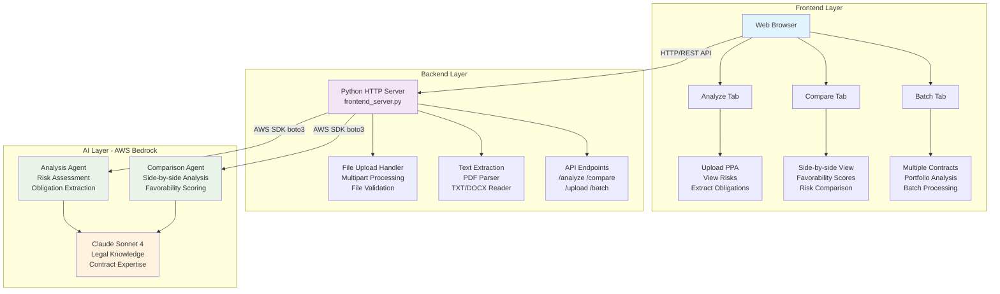

# PPA Contract Analysis Platform

AI-powered analysis and comparison tool for Power Purchase Agreements (PPAs) and renewable energy contracts.

[](https://www.python.org/)
[](https://aws.amazon.com/bedrock/)

## Overview

This platform analyzes Power Purchase Agreements using AWS Bedrock's Claude Sonnet 4 model. It extracts key terms, identifies risks, and provides structured analysis for renewable energy contracts.

**Primary Use Case:** PPA analysis for solar, wind, and other renewable energy projects.

## Features

- **Contract Analysis**: Upload PPAs (PDF, TXT, DOCX) for AI-powered analysis
- **Contract Comparison**: Side-by-side analysis of two contracts with favorability scoring
- **Batch Processing**: Analyze multiple contracts simultaneously
- **Risk Assessment**: Identify pricing, performance, and legal risks
- **Obligation Extraction**: Extract key obligations, deadlines, and party responsibilities

## Supported Contract Types

- Power Purchase Agreements (PPAs)
- Renewable Energy Agreements (REAs)
- Solar and wind energy contracts
- Energy storage agreements
- Virtual PPAs and other renewable energy instruments

## Architecture



### Components

- **Frontend**: Web interface (HTML/CSS/JS) for uploading and viewing contract analysis
- **Backend**: Python HTTP server (`frontend_server.py`) handling requests and file processing
- **AI Engine**: AWS Bedrock Agents with Claude Sonnet 4 for contract analysis
- **File Processing**: Support for PDF, TXT, DOCX text extraction
- **API Layer**: REST endpoints for analysis, comparison, and batch processing

### Data Flow

1. **Upload**: User uploads contract file or pastes text
2. **Extract**: Server extracts text from uploaded files
3. **Analyze**: Text sent to AWS Bedrock Agent for AI analysis
4. **Process**: Claude Sonnet 4 analyzes contract structure, risks, obligations
5. **Return**: Structured JSON response with analysis results
6. **Display**: Frontend renders analysis in user-friendly format

## Quick Start

### Prerequisites

- Python 3.8+
- AWS Account with Bedrock access
- AWS credentials configured

### Installation

```bash
# Clone repository
git clone <your-repo-url>
cd contract-ai-platform

# Create virtual environment
python3 -m venv venv
source venv/bin/activate  # On Windows: venv\Scripts\activate

# Install dependencies
pip install -r requirements.txt

# Configure AWS credentials
cp .env.example .env
# Edit .env with your AWS_ACCESS_KEY_ID and AWS_SECRET_ACCESS_KEY

# Start server
python3 frontend_server.py 8094
```

### Access Application

Open your browser to: **http://localhost:8094**

### Test with Sample Contracts

```bash
# View sample contracts
cat sample_contracts/good_ppa_solar_farm.txt
cat sample_contracts/good_ppa_wind_project.txt
```

Copy contract text into the **Analyze** tab to test the AI analysis.

> **Note**: Don't commit AWS credentials to version control. The `.env` file is gitignored for this purpose.

## API Documentation

### Endpoints

#### Health Check

```
GET /api/health
Response: {"status": "healthy", "service": "agentcore-v3"}
```

#### Analyze Contract

```
POST /api/agentcore/analyze
Body: {
  "contract_text": "string",
  "jurisdiction": "US"
}
```

#### Compare Contracts

```
POST /api/agentcore/compare
Body: {
  "contract_a_text": "string",
  "contract_b_text": "string",
  "jurisdiction": "US"
}
```

#### Upload File

```
POST /api/upload
Body: multipart/form-data with "file" field
Response: {"success": true, "text": "extracted text", "filename": "contract.pdf"}
```

## Project Structure

```
contract-ai-platform/
├── frontend/                 # Web interface
│   ├── css/                 # Stylesheets
│   ├── js/                  # JavaScript modules
│   └── v3-app.html         # Main HTML
├── agents/                  # Backend AI agents
│   ├── contract_analysis_entrypoint.py
│   ├── contract_comparison_entrypoint.py
│   └── batch_processing_entrypoint.py
├── config/                  # Configuration files
├── sample_contracts/        # Test contracts
├── frontend_server.py       # HTTP server
├── requirements.txt         # Dependencies
└── .env.example            # Environment template
```

## Configuration

### AWS Bedrock Agents

| Agent      | ID           | Purpose             |
| ---------- | ------------ | ------------------- |
| Analysis   | `OTNEP8O85O` | Contract analysis   |
| Comparison | `UH8WCAURTA` | Contract comparison |

### Environment Variables

```bash
AWS_ACCESS_KEY_ID=your_access_key
AWS_SECRET_ACCESS_KEY=your_secret_key
AWS_DEFAULT_REGION=us-east-1
SERVER_PORT=8094
```

## Troubleshooting

### Common Issues

**Server won't start**

```bash
# Check if port is in use
lsof -i :8094
# Kill existing process
pkill -f "frontend_server.py"
```

**AWS credentials error**

```bash
# Verify credentials
echo $AWS_ACCESS_KEY_ID
aws sts get-caller-identity
```

**Analysis fails**

- Verify AWS Bedrock access in your account
- Check agent IDs are correct in configuration
- Ensure contract text is not empty

**File upload fails (Python 3.13+)**

- File upload is supported in Python 3.13+
- Use text paste as alternative
- Check file size (max 10MB)

### Error Messages

| Error                | Solution                                            |
| -------------------- | --------------------------------------------------- |
| `Connection refused` | Start server with `python3 frontend_server.py 8094` |
| `401 Unauthorized`   | Check AWS credentials                               |
| `403 Forbidden`      | Request Bedrock access in AWS console               |

## Development

### Adding Features

1. Create agent logic in `agents/`
2. Add API endpoint in `frontend_server.py`
3. Create UI components in `frontend/js/`
4. Update styles in `frontend/css/`

### Testing

```bash
# Install test dependencies
pip install pytest

# Run tests
pytest

# Manual testing
curl -s http://localhost:8094/api/health
```

## License

Proprietary - All rights reserved

---

**Built for Power Purchase Agreement analysis using AWS Bedrock and Claude Sonnet 4**
