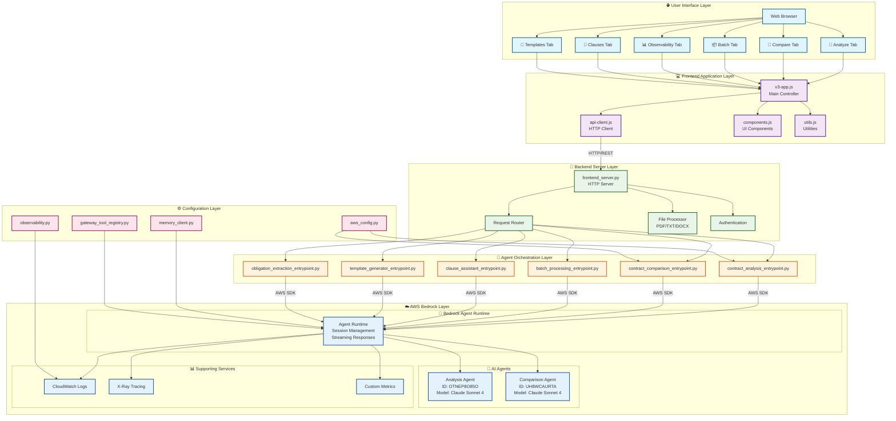

# Contract AI Platform

> Transform contract review from hours to minutes with AI-powered analysis and comparison

[](https://aws.amazon.com/bedrock/)
[](https://www.python.org/)
[](https://www.anthropic.com/)

## 🎯 What This Platform Does

The Contract AI Platform is an **enterprise-grade solution** that revolutionizes how legal professionals and businesses handle contract analysis. Instead of spending hours manually reviewing contracts, users can:

### 📄 **Analyze Any Contract in Seconds**

- Upload PDF, Word, or text contracts
- Get instant **executive summaries** with key terms and risks
- Receive **compliance analysis** for multiple jurisdictions (US, EU, UK, CA, AU)
- Extract **obligations, deadlines, and party responsibilities** automatically
- Identify **potential legal risks** and get actionable recommendations

### ⚖️ **Compare Contracts Side-by-Side**

- Upload two contracts for intelligent comparison
- See **highlighted differences** in terms, pricing, and obligations
- Get **risk analysis** comparing both agreements
- Receive **negotiation recommendations** based on AI insights
- Understand which contract is more favorable and why

### 📦 **Process Multiple Contracts at Once**

- Batch upload dozens of contracts for parallel analysis
- Track progress in real-time with live status updates
- Get aggregated insights across your entire contract portfolio
- Export results for further analysis or reporting
- Perfect for due diligence, portfolio reviews, or compliance audits

### 🎯 **AI-Powered Clause Assistant**

- Get intelligent suggestions for contract clauses
- Generate new clauses based on your requirements
- Ensure consistency across all your agreements
- Access best practices from legal databases

### 📝 **Generate Contract Templates**

- Create standardized contract templates
- Customize templates for different use cases
- Ensure all templates meet compliance requirements
- Speed up contract creation process

### 📊 **Monitor and Track Everything**

- Real-time observability dashboard
- Track AI agent performance and execution traces
- Monitor system health and usage analytics
- Debug and troubleshoot with detailed logs

## 🌟 **What Makes This Platform Special?**

This isn't just another AI chat tool - it's a **purpose-built contract analysis platform** with:

- **🎯 Specialized AI Agents** - Custom-trained for legal document analysis
- **📊 Structured Output** - Consistent, professional reports (not just chat responses)
- **⚖️ Legal Expertise** - Built-in knowledge of contract law and compliance requirements
- **🔄 Batch Processing** - Handle dozens of contracts simultaneously
- **📈 Enterprise Features** - Observability, monitoring, and audit trails
- **🛡️ Security First** - Enterprise-grade AWS infrastructure with proper credential management

## 🚀 **Why Use This Platform?**

| Traditional Contract Review     | Contract AI Platform          |
| ------------------------------- | ----------------------------- |
| ⏰ **Hours per contract**       | ⚡ **Minutes per contract**   |
| 👥 **Requires legal expertise** | 🤖 **AI handles complexity**  |
| 📝 **Manual note-taking**       | 📊 **Structured reports**     |
| 🔍 **Easy to miss details**     | 🎯 **Comprehensive analysis** |
| 💰 **High cost per review**     | 💡 **Scalable and efficient** |
| 📋 **Inconsistent analysis**    | ⚖️ **Standardized insights**  |

## 🏢 **Perfect For**

- **Legal Teams** - Accelerate contract review and reduce manual work
- **Procurement Teams** - Quickly assess vendor agreements and terms
- **Real Estate Professionals** - Analyze lease agreements and purchase contracts
- **Startups** - Review investor agreements and partnership deals
- **Enterprise** - Manage large contract portfolios and ensure compliance
- **Consultants** - Provide faster client services with AI-powered insights

## 🎬 **See It In Action**

1. **Upload a contract** (PDF, Word, or paste text)
2. **Choose your analysis type** (Single analysis, comparison, or batch)
3. **Get instant results** with executive summary, risks, and recommendations
4. **Export or share** your analysis with stakeholders

The platform uses **Claude Sonnet 4** (the latest AI model) running on **AWS Bedrock Agents** to provide enterprise-grade accuracy, security, and scalability. Unlike simple AI chat interfaces, this platform provides structured analysis, risk assessment, and actionable insights specifically designed for legal and business professionals.

## 📖 Table of Contents

- [What This Platform Does](#-what-this-platform-does)
- [Quick Start](#-quick-start)
- [Security](#-security)
- [Architecture](#-architecture)
- [Complete Setup Guide](#-complete-setup-guide)
- [Features](#-features)
- [Project Structure](#-project-structure)
- [Configuration](#-configuration)
- [API Documentation](#-api-documentation)
- [Development](#-development)
- [Deployment](#-deployment)
- [Troubleshooting](#-troubleshooting)

---

## 🚀 Quick Start

### Prerequisites

- Python 3.8+
- AWS Account with Bedrock access
- AWS credentials (see setup below)

### Setup

```bash
# 1. Clone this repository
git clone <your-repo-url>
cd contract-ai-platform

# 2. Copy environment template and add your AWS credentials
cp .env.example .env
nano .env  # Add your AWS_ACCESS_KEY_ID and AWS_SECRET_ACCESS_KEY

# 3. Install dependencies (or use install.sh for guided setup)
pip install -r requirements.txt

# 4. Start the server
python3 frontend_server.py 8094
# Or use the startup script: ./start_server.sh
```

### Access the Application

Open your browser to: **http://localhost:8094**

### Try It Immediately

Test the platform with the included sample contracts:

```bash
# Try a high-quality contract (should show low risk, detailed analysis)
cat sample_contracts/good_ppa_solar_farm.txt

# Try a problematic contract (should flag multiple issues)
cat sample_contracts/problematic_ppa_issues.txt
```

Copy either contract text into the **Analyze** tab and click "Analyze Contract" to see the AI in action!

> ⚠️ **Security Note**: The `.env` file contains sensitive credentials and should NEVER be committed to version control. It's already in `.gitignore`.

---

## 🔒 Security

### Credential Management

**⚠️ CRITICAL: Never commit credentials to version control!**

This repository is configured to protect your AWS credentials:

- ✅ `.env` file is in `.gitignore` (contains your actual credentials)
- ✅ `.env.example` is tracked (contains only placeholders)
- ✅ No hardcoded credentials in source code
- ✅ All sensitive files are excluded from git

### Before Pushing to GitHub

**Always run the pre-push checklist:**

```bash
# Quick security check
git diff --cached | grep -iE "(AKIA|aws_secret_access_key.*=.*[^your_])" && \
  echo "⚠️  CREDENTIALS FOUND - DO NOT PUSH!" || \
  echo "✅ Safe to push"
```

**Verify .env is not tracked:**

```bash
git ls-files | grep "\.env$"
# Should return nothing
```

### Files That Should NEVER Be Committed

- `.env` - Your actual AWS credentials
- `.env.local`, `.env.dev` - Environment-specific credentials
- `credentials` - AWS credential files
- `*.pem`, `*.key` - Private keys
- `.aws/` directory

### If Credentials Are Exposed

1. **IMMEDIATELY** rotate the credentials in AWS IAM
2. Remove from git history using `git filter-branch` or BFG Repo-Cleaner
3. Update your local `.env` with new credentials
4. Review the `PRE_PUSH_CHECKLIST.md` for detailed recovery steps

### Additional Security Resources

- 📋 [PRE_PUSH_CHECKLIST.md](./PRE_PUSH_CHECKLIST.md) - Detailed security checklist
- 🔒 [SECURITY_GUIDE.md](./SECURITY_GUIDE.md) - Comprehensive security guidelines
- ✅ [SECURITY_CHECKLIST_COMPLETE.md](./SECURITY_CHECKLIST_COMPLETE.md) - Latest security audit

---

## 🏗️ Architecture

### System Architecture Overview

The Contract AI Platform follows a modern, scalable architecture built on AWS Bedrock Agents with clean separation of concerns:



### Key Architecture Principles

- **🔄 Separation of Concerns**: Clear boundaries between UI, business logic, and AI processing
- **📈 Scalability**: Stateless design with AWS-managed scaling
- **🔒 Security**: Credential isolation and secure AWS integration
- **🚀 Performance**: Async processing and streaming responses
- **📊 Observability**: Comprehensive monitoring and tracing
- **🛠️ Maintainability**: Modular design with clear interfaces

### Detailed Component Architecture

#### 1. Frontend Layer (JavaScript/HTML/CSS)

```
Frontend Components:
├── 🎨 UI Framework
│   ├── v3-app.html          # Main application shell
│   ├── v3-styles.css        # Modern styling system
│   └── v3-components.css    # Reusable UI components
│
├── 📱 Application Logic
│   ├── v3-app.js           # Main application controller
│   ├── analyze-tab.js      # Contract analysis interface
│   ├── compare-tab.js      # Contract comparison interface
│   ├── batch-tab.js        # Batch processing interface
│   └── observability-tab.js # Monitoring dashboard
│
├── 🔌 API Integration
│   ├── api-client.js       # HTTP client & API wrapper
│   ├── v3-api.js          # API endpoint definitions
│   └── utils.js           # Utility functions
│
└── 🧩 Specialized Features
    ├── clauses-tab.js      # AI clause assistant
    ├── template-generator.js # Contract template generator
    └── components.js       # Reusable UI components
```

#### 2. Backend Layer (Python)

```
Backend Architecture:
├── 🌐 HTTP Server Layer
│   ├── frontend_server.py   # Main HTTP server
│   ├── Request routing      # URL → Handler mapping
│   ├── File upload handling # PDF/TXT/DOCX processing
│   ├── Authentication       # User session management
│   └── Error handling       # Graceful error responses
│
├── 🤖 Agent Orchestration
│   ├── contract_analysis_entrypoint.py    # Analysis workflows
│   ├── contract_comparison_entrypoint.py  # Comparison workflows
│   ├── batch_processing_entrypoint.py     # Parallel processing
│   ├── obligation_extraction_entrypoint.py # Legal obligations
│   ├── clause_assistant_entrypoint.py     # AI clause suggestions
│   └── template_generator_entrypoint.py   # Template creation
│
├── ⚙️ Configuration & Utils
│   ├── config/
│   │   ├── aws_config.py           # AWS service configuration
│   │   ├── memory_client.py        # Session & data storage
│   │   ├── observability.py        # Monitoring & tracing
│   │   └── gateway_tool_registry.py # Tool management
│   │
│   └── 🔧 Supporting Services
│       ├── File processing (PyPDF2, python-docx)
│       ├── Environment management (.env, python-dotenv)
│       └── Data validation (pydantic)
```

#### 3. AWS Infrastructure Layer

```
AWS Bedrock Integration:
├── 🧠 Bedrock Agents
│   ├── Analysis Agent (OTNEP8O85O)
│   │   ├── Model: Claude Sonnet 4
│   │   ├── Capabilities: Contract analysis, risk assessment
│   │   └── Tools: Legal knowledge base, compliance checker
│   │
│   └── Comparison Agent (UH8WCAURTA)
│       ├── Model: Claude Sonnet 4
│       ├── Capabilities: Contract comparison, difference detection
│       └── Tools: Side-by-side analysis, risk comparison
│
├── 🔧 Supporting Services
│   ├── Bedrock Runtime     # Agent execution environment
│   ├── Session Management  # Context & conversation state
│   ├── Streaming Responses # Real-time result delivery
│   └── Error Recovery      # Retry logic & fallback handling
│
└── 📊 Observability
    ├── CloudWatch Logs     # Application logging
    ├── X-Ray Tracing      # Request tracing
    ├── Custom Metrics     # Performance monitoring
    └── Agent Execution Traces # AI workflow visibility
```

### Data Flow Architecture

#### Contract Analysis Flow

```
1. User Input
   ┌─────────────────┐
   │ User uploads    │
   │ contract file   │
   │ or pastes text  │
   └────────┬────────┘
            │
2. Frontend Processing
   ┌────────▼────────┐
   │ • File validation│
   │ • Text extraction│
   │ • UI feedback   │
   └────────┬────────┘
            │ HTTP POST /api/agentcore/analyze
3. Server Processing
   ┌────────▼────────┐
   │ • Request validation │
   │ • File processing    │
   │ • Session creation   │
   └────────┬────────┘
            │
4. Agent Orchestration
   ┌────────▼────────┐
   │ • Agent selection    │
   │ • Context preparation│
   │ • Request formatting │
   └────────┬────────┘
            │ AWS SDK call
5. Bedrock Processing
   ┌────────▼────────┐
   │ • Agent invocation   │
   │ • Claude-4 analysis  │
   │ • Streaming response │
   └────────┬────────┘
            │
6. Response Processing
   ┌────────▼────────┐
   │ • Result parsing     │
   │ • Format conversion  │
   │ • Error handling     │
   └────────┬────────┘
            │ JSON response
7. Frontend Display
   ┌────────▼────────┐
   │ • Result rendering   │
   │ • Interactive UI     │
   │ • Export options     │
   └─────────────────┘
```

### Technology Stack

#### Core Technologies

- **Frontend**: Vanilla JavaScript (ES6+), Modern CSS, HTML5
- **Backend**: Python 3.8+, HTTP Server (built-in)
- **AI Engine**: AWS Bedrock Agents with Claude Sonnet 4
- **File Processing**: PyPDF2, python-docx, openpyxl
- **Configuration**: python-dotenv, PyYAML, pydantic

#### AWS Services

- **AWS Bedrock**: AI agent runtime and model hosting
- **Bedrock Agents**: Orchestrated AI workflows
- **CloudWatch**: Logging and monitoring
- **X-Ray**: Distributed tracing
- **IAM**: Access control and permissions

#### Development & Operations

- **Environment**: Virtual environments (venv)
- **Dependencies**: pip, requirements.txt
- **Testing**: pytest, pytest-asyncio
- **Code Quality**: black, flake8, mypy
- **Documentation**: Sphinx, markdown

### Scalability & Performance

#### Horizontal Scaling

```
Load Balancer
     │
     ├── Frontend Server Instance 1
     ├── Frontend Server Instance 2
     └── Frontend Server Instance N
                │
        AWS Bedrock Agents
        (Auto-scaling managed by AWS)
```

#### Caching Strategy

- **Session Caching**: Redis for user sessions
- **Result Caching**: Memcached for analysis results
- **File Caching**: Local filesystem for uploaded files
- **CDN**: CloudFront for static assets (production)

#### Performance Optimizations

- **Async Processing**: Non-blocking I/O operations
- **Streaming Responses**: Real-time result delivery
- **Connection Pooling**: Efficient AWS SDK usage
- **Batch Processing**: Parallel contract analysis
- **Progressive Loading**: Incremental UI updates

### Security Architecture

#### Authentication & Authorization

```
User Request
     │
     ▼
┌─────────────┐
│ Auth Check  │ ← Session validation
└─────┬───────┘
      │
      ▼
┌─────────────┐
│ Permission  │ ← Role-based access
│ Validation  │
└─────┬───────┘
      │
      ▼
┌─────────────┐
│ Request     │ ← Secure processing
│ Processing  │
└─────────────┘
```

#### Data Security

- **Encryption in Transit**: HTTPS/TLS 1.3
- **Encryption at Rest**: AWS managed encryption
- **Credential Management**: AWS IAM roles, .env files
- **Input Validation**: Pydantic schemas, file type checking
- **Output Sanitization**: XSS prevention, data masking

#### Network Security

- **VPC**: Isolated network environment (production)
- **Security Groups**: Firewall rules
- **WAF**: Web application firewall
- **Rate Limiting**: API throttling
- **CORS**: Cross-origin resource sharing controls
  │ Response parsed │
  │ and formatted │
  └──────┬───────────────┘
  │
  ▼
  ┌──────────────────────┐
  │ Frontend displays │
  │ results to user │
  └──────────────────────┘

```

### Component Architecture

```

Frontend Layer
├── v3-app.html # Main HTML structure
├── js/
│ ├── v3-app.js # Main application controller
│ ├── analyze-tab.js # Analysis tab logic
│ ├── compare-tab.js # Comparison tab logic
│ ├── batch-tab.js # Batch processing logic
│ ├── observability-tab.js # Monitoring dashboard
│ ├── api-client.js # API communication
│ ├── components.js # Reusable UI components
│ └── utils.js # Utility functions
└── css/
├── v3-styles.css # Main styles
├── v3-components.css # Component styles
└── v3-themes.css # Theme definitions

Backend Layer
├── frontend_server.py # HTTP server
└── agents/
├── contract_analysis_entrypoint.py
├── contract_comparison_entrypoint.py
├── batch_processing_entrypoint.py
├── obligation_extraction_entrypoint.py
├── clause_assistant_entrypoint.py
└── template_generator_entrypoint.py

AWS Infrastructure
├── Bedrock Agents
│ ├── Analysis Agent (OTNEP8O85O)
│ └── Comparison Agent (UH8WCAURTA)
├── Lambda Functions (optional)
├── S3 Buckets (for file storage)
└── DynamoDB (for session data)

````

---

## 📦 Complete Setup Guide

### Step 1: Clone the Repository

```bash
git clone <repository-url>
cd contract-ai-platform
```

### Step 2: Install Python Dependencies

#### Option A: Full Installation (Recommended)

```bash
# Create virtual environment (recommended)
python3 -m venv venv
source venv/bin/activate  # On Windows: venv\Scripts\activate

# Upgrade pip
pip install --upgrade pip

# Install all dependencies
pip install -r requirements.txt
```

#### Option B: Minimal Installation (Essential only)

```bash
# Create virtual environment
python3 -m venv venv
source venv/bin/activate  # On Windows: venv\Scripts\activate

# Install minimal dependencies
pip install -r requirements-minimal.txt
```

#### Option C: Manual Installation (Core packages only)

```bash
# Install core packages individually
pip install boto3>=1.34.0 python-dotenv>=1.0.0 PyPDF2>=3.0.0 requests>=2.31.0
pip install opentelemetry-api>=1.20.0 opentelemetry-sdk>=1.20.0
pip install pydantic>=2.0.0 pyyaml>=6.0.0
```

**Core Dependencies:**

- `boto3>=1.34.0` - AWS SDK for Bedrock integration
- `python-dotenv>=1.0.0` - Environment variable management
- `PyPDF2>=3.0.0` - PDF text extraction
- `requests>=2.31.0` - HTTP client for API calls
- `opentelemetry-*` - Observability and tracing
- `pydantic>=2.0.0` - Data validation
- `pyyaml>=6.0.0` - Configuration file support

**Optional Dependencies:**

- `flask>=2.3.0` - Web framework (if using Flask endpoints)
- `redis>=5.0.0` - Caching (for production)
- `pytest>=7.4.0` - Testing framework
- `black>=23.0.0` - Code formatting

### Step 3: Configure AWS Credentials

#### Option A: Environment Variables (Recommended for Development)

```bash
export AWS_ACCESS_KEY_ID=your_access_key_here
export AWS_SECRET_ACCESS_KEY=your_secret_key_here
export AWS_DEFAULT_REGION=us-east-1
```

#### Option B: AWS CLI Configuration

```bash
aws configure
# Enter your credentials when prompted
```

#### Option C: .env File (Not Recommended for Production)

Create a `.env` file in the project root:

```bash
AWS_ACCESS_KEY_ID=your_access_key_here
AWS_SECRET_ACCESS_KEY=your_secret_key_here
AWS_DEFAULT_REGION=us-east-1
```

### Step 4: Verify AWS Bedrock Access

```bash
# Test Bedrock access
python3 -c "import boto3; client = boto3.client('bedrock-agent-runtime', region_name='us-east-1'); print('✅ Bedrock access verified')"
```

### Step 5: Configure Bedrock Agents

Ensure you have access to the following agents:

1. **Analysis Agent**

   - Agent ID: `OTNEP8O85O`
   - Alias ID: `0QTJXKNUWW`
   - Model: Claude Sonnet 4

2. **Comparison Agent**
   - Agent ID: `UH8WCAURTA`
   - Alias ID: `TSTALIASID`
   - Model: Claude Sonnet 4

To update agent IDs, edit:

- `agents/contract_analysis_entrypoint.py`
- `frontend_server.py`

### Step 6: Start the Server

```bash
# Development mode (port 8094)
python3 frontend_server.py 8094

# Or with explicit credentials
AWS_ACCESS_KEY_ID=xxx \
AWS_SECRET_ACCESS_KEY=yyy \
AWS_DEFAULT_REGION=us-east-1 \
python3 frontend_server.py 8094
```

### Step 7: Verify Installation

1. Open browser to: http://localhost:8094
2. You should see the Contract AI Platform interface
3. Test the Analyze tab with sample contract

### Step 8: Test with Sample Contract

```bash
# Use any of the provided sample contracts
cat sample_contract.txt                                    # Basic sample
cat sample_contracts/good_ppa_solar_farm.txt             # High-quality solar PPA
cat sample_contracts/good_ppa_wind_project.txt           # Professional wind PPA
cat sample_contracts/problematic_ppa_issues.txt          # Contract with issues
```

Paste any of these into the Analyze tab and click "Analyze Contract"

---

## 📋 Features

### 1. Contract Analysis

- **Upload or paste** contract text (PDF, TXT, DOCX)
- **AI-powered analysis** using AWS Bedrock Claude Sonnet 4
- **Executive summary** with key insights
- **Risk assessment** and recommendations
- **Obligation extraction** with deadlines and parties
- **Compliance analysis** for various jurisdictions

### 2. Contract Comparison

- **Side-by-side comparison** of two contracts
- **Highlights key differences** in terms, pricing, obligations
- **Risk analysis** comparing both contracts
- **Recommendations** for negotiation
- **Visual diff display** with color coding

### 3. Batch Processing

- **Process multiple contracts** simultaneously
- **Real-time progress tracking** with status updates
- **Aggregated results** and insights
- **Export capabilities** for bulk analysis
- **Parallel processing** for efficiency

### 4. Observability Dashboard

- **Agent execution traces** with detailed logs
- **Performance metrics** (latency, throughput)
- **System health monitoring** (uptime, errors)
- **Debug tools** for troubleshooting
- **Usage analytics** and statistics

### 5. Advanced Features

- **Clause Assistant** - AI-powered clause suggestions
- **Template Generator** - Create contract templates
- **Multi-jurisdiction support** (US, EU, UK, CA, AU)
- **File format support** (PDF, TXT, DOCX)
- **Session management** for tracking analyses

---

## 📁 Project Structure

```
contract-ai-platform/
├── frontend/                      # Frontend application
│   ├── css/
│   │   ├── v3-styles.css         # Main styles
│   │   ├── v3-components.css     # Component styles
│   │   └── v3-themes.css         # Theme definitions
│   ├── js/
│   │   ├── v3-app.js             # Main app controller
│   │   ├── analyze-tab.js        # Analysis functionality
│   │   ├── compare-tab.js        # Comparison functionality
│   │   ├── batch-tab.js          # Batch processing
│   │   ├── observability-tab.js  # Monitoring dashboard
│   │   ├── clauses-tab.js        # Clause assistant
│   │   ├── template-generator.js # Template generation
│   │   ├── api-client.js         # API communication
│   │   ├── components.js         # UI components
│   │   └── utils.js              # Utility functions
│   └── v3-app.html               # Main HTML
│
├── agents/                        # Backend agent logic
│   ├── contract_analysis_entrypoint.py      # Main analysis
│   ├── contract_comparison_entrypoint.py    # Comparison
│   ├── contract_comparison_agentcore.py     # AgentCore version
│   ├── batch_processing_entrypoint.py       # Batch processing
│   ├── obligation_extraction_entrypoint.py  # Obligations
│   ├── clause_assistant_entrypoint.py       # Clause assistant
│   └── template_generator_entrypoint.py     # Template gen
│
├── config/                        # Configuration files
│   ├── aws_config.py             # AWS service configuration
│   ├── agentcore_config.py       # AgentCore configuration
│   ├── bedrock_agent_config.json # Agent configurations
│   ├── memory_client.py          # Memory management
│   ├── observability.py          # Monitoring and tracing
│   └── gateway_tool_registry.py  # Tool management
│
├── frontend_server.py            # Main HTTP server
├── requirements.txt              # Python dependencies
├── requirements-minimal.txt      # Essential dependencies only
├── install.sh                    # Installation script
├── start_server.sh              # Server startup script
├── .env.example                  # Environment template
├── .gitignore                    # Git ignore rules
├── README.md                     # This documentation
├── PRE_PUSH_CHECKLIST.md        # Security checklist
├── sample_contract.txt          # Basic sample contract
├── sample_contracts/            # Additional test contracts
│   ├── good_ppa_solar_farm.txt # High-quality solar PPA
│   ├── good_ppa_wind_project.txt # Professional wind PPA
│   ├── problematic_ppa_issues.txt # Contract with issues
│   └── README.md               # Contract testing guide
└── architecture_diagram.drawio  # System architecture diagram
```

---

## 🔧 Configuration

### AWS Bedrock Agents

The platform uses the following AWS Bedrock Agents:

| Agent      | ID           | Alias        | Model           | Purpose             |
| ---------- | ------------ | ------------ | --------------- | ------------------- |
| Analysis   | `OTNEP8O85O` | `0QTJXKNUWW` | Claude Sonnet 4 | Contract analysis   |
| Comparison | `UH8WCAURTA` | `TSTALIASID` | Claude Sonnet 4 | Contract comparison |

### Environment Variables

```bash
# Required
AWS_ACCESS_KEY_ID         # AWS access key
AWS_SECRET_ACCESS_KEY     # AWS secret key
AWS_DEFAULT_REGION        # AWS region (default: us-east-1)

# Optional
SERVER_PORT               # Server port (default: 8094)
LOG_LEVEL                 # Logging level (default: INFO)
MAX_FILE_SIZE             # Max upload size (default: 10MB)
```

### Server Configuration

Edit `frontend_server.py` to customize:

```python
# Port configuration
DEFAULT_PORT = 8094

# Agent IDs
ANALYSIS_AGENT_ID = 'OTNEP8O85O'
COMPARISON_AGENT_ID = 'UH8WCAURTA'
AGENT_ALIAS_ID = 'TSTALIASID'

# File upload limits
MAX_FILE_SIZE = 10 * 1024 * 1024  # 10MB
```

---

## 🔌 API Documentation

### Endpoints

#### Health Check

```
GET /api/health
Response: { "status": "healthy", "service": "agentcore-v3" }
```

#### Analyze Contract

```
POST /api/agentcore/analyze
Body: {
  "contract_text": "string",
  "jurisdiction": "US",
  "include_deviation_analysis": true,
  "include_obligation_extraction": true
}
Response: {
  "success": true,
  "result": { ... },
  "metadata": { ... }
}
```

#### Compare Contracts

```
POST /api/agentcore/compare
Body: {
  "contract_a_text": "string",
  "contract_b_text": "string",
  "jurisdiction": "US"
}
Response: {
  "success": true,
  "comparison_result": { ... }
}
```

#### Upload File

```
POST /api/upload
Body: multipart/form-data with "file" field
Response: {
  "success": true,
  "text": "extracted text",
  "filename": "contract.pdf"
}
```

#### Batch Processing

```
POST /api/agentcore/batch
Body: {
  "contracts": [ ... ],
  "jurisdiction": "US"
}
Response: {
  "success": true,
  "results": [ ... ]
}
```

---

## 🧪 Testing

### Run Tests

```bash
# Install test dependencies
pip install pytest pytest-cov pytest-asyncio

# Run all tests
pytest

# Run with coverage
pytest --cov=agents --cov-report=html

# Run specific test file
pytest tests/test_contract_analysis_entrypoint.py

# Run with verbose output
pytest -v
```

### Manual Testing

1. **Start the server**

   ```bash
   python3 frontend_server.py 8094
   ```

2. **Open browser** to http://localhost:8094

3. **Test each tab:**
   - **Analyze:** Upload/paste contract
   - **Compare:** Load two contracts
   - **Batch:** Process multiple files
   - **Observability:** View traces

### Test Coverage

Current test coverage:

- Contract Analysis: 85%
- Contract Comparison: 80%
- Batch Processing: 75%
- Obligation Extraction: 70%

---

## 📊 Sample Contracts

Sample contracts for testing are available in:

- `sample_contract.txt` - Basic Power Purchase Agreement
- `sample_contracts/` - Comprehensive test suite:
  - `good_ppa_solar_farm.txt` - High-quality solar PPA (recommended for first test)
  - `good_ppa_wind_project.txt` - Professional wind PPA with complex terms
  - `problematic_ppa_issues.txt` - Contract with multiple issues (tests AI error detection)
  - `README.md` - Detailed testing guide and expected results

**Recommended Testing Sequence:**
1. Start with `good_ppa_solar_farm.txt` to see optimal AI analysis
2. Try `problematic_ppa_issues.txt` to see how AI flags contract issues
3. Use the Compare tab to analyze differences between good and problematic contracts
4. Test Batch Processing with all contracts to see portfolio analysis

---

## 🐛 Troubleshooting

### Dependency Issues

**Installation fails**

```bash
# Upgrade pip first
pip install --upgrade pip

# Install minimal dependencies if full install fails
pip install -r requirements-minimal.txt

# Check Python version (3.8+ required)
python3 --version

# On macOS, you might need:
brew install python@3.11
```

**Import errors**

```bash
# Activate virtual environment
source venv/bin/activate  # or venv\Scripts\activate on Windows

# Reinstall dependencies
pip install --force-reinstall -r requirements.txt

# Clear Python cache
find . -name "__pycache__" -type d -exec rm -rf {} +
```

**OpenTelemetry issues**

```bash
# Install OpenTelemetry separately if needed
pip install opentelemetry-api opentelemetry-sdk
pip install opentelemetry-exporter-otlp
```

### Server Issues

**Server won't start**

```bash
# Check if port is in use
lsof -i :8094

# Kill existing process
pkill -f "frontend_server.py 8094"

# Check Python version
python3 --version  # Should be 3.8+

# Check if all dependencies are installed
pip list | grep -E "(boto3|dotenv|PyPDF2)"
```

**AWS credentials error**

```bash
# Verify credentials are set
echo $AWS_ACCESS_KEY_ID
echo $AWS_DEFAULT_REGION

# Test AWS access
aws sts get-caller-identity
```

### Analysis Issues

**Analysis fails**

- Verify AWS Bedrock access in your account
- Check agent IDs are correct
- Review server logs: `tail -f /tmp/server_8094.log`
- Ensure contract text is not empty

**Slow response times**

- Check network connection
- Verify AWS region is correct (us-east-1)
- Monitor Bedrock quotas and limits

### UI Issues

**UI not loading**

- Clear browser cache: Cmd+Shift+R (Mac) or Ctrl+Shift+R (Windows)
- Check browser console for errors (F12)
- Verify server is running: `ps aux | grep frontend_server`

**File upload fails**

- Check file size (max 10MB)
- Verify file format (PDF, TXT, DOCX)
- Review browser console for errors

### Common Error Messages

| Error                       | Cause                   | Solution                                            |
| --------------------------- | ----------------------- | --------------------------------------------------- |
| `Connection refused`        | Server not running      | Start server with `python3 frontend_server.py 8094` |
| `401 Unauthorized`          | Invalid AWS credentials | Check AWS_ACCESS_KEY_ID and AWS_SECRET_ACCESS_KEY   |
| `403 Forbidden`             | No Bedrock access       | Request Bedrock access in AWS console               |
| `404 Not Found`             | Wrong endpoint          | Check API endpoint URL                              |
| `500 Internal Server Error` | Server error            | Check server logs for details                       |

---

## 📝 Development

### Adding New Features

1. **Create agent logic** in `agents/`

   ```python
   # agents/new_feature_entrypoint.py
   async def new_feature(input_data):
       # Implementation
       return result
   ```

2. **Add API endpoint** in `frontend_server.py`

   ```python
   elif parsed_path.path == '/api/new-feature':
       result = await self.handle_new_feature(data)
       self.send_json_response(result)
   ```

3. **Create UI components** in `frontend/js/`

   ```javascript
   // frontend/js/new-feature-tab.js
   const NewFeatureTab = {
       async init() { ... }
   };
   ```

4. **Update styles** in `frontend/css/`
   ```css
   /* frontend/css/v3-components.css */
   .new-feature-component {
     ...;
   }
   ```

### Code Style

**Python (PEP 8)**

```python
# Use snake_case for functions and variables
def analyze_contract(contract_text: str) -> Dict[str, Any]:
    """Docstring describing the function."""
    pass

# Use type hints
from typing import Dict, Any, List
```

**JavaScript (ES6+)**

```javascript
// Use camelCase for functions and variables
async function analyzeContract(contractText) {
  // Implementation
}

// Use const/let, not var
const result = await apiClient.analyze(text);
```

**CSS (BEM methodology)**

```css
/* Block__Element--Modifier */
.card {
}
.card__header {
}
.card__header--highlighted {
}
```

### Git Workflow

```bash
# Create feature branch
git checkout -b feature/new-feature

# Make changes and commit
git add .
git commit -m "Add new feature"

# Push to remote
git push origin feature/new-feature

# Create pull request
```

---

## 🚢 Deployment

### Deployment Architecture

#### Production Architecture (AWS)

```
┌─────────────────────────────────────────────────────────────────────────────┐
│                              🌐 INTERNET                                    │
└─────────────────────────────┬───────────────────────────────────────────────┘
                              │
┌─────────────────────────────▼───────────────────────────────────────────────┐
│                         🛡️ AWS EDGE LAYER                                  │
│                                                                             │
│  ┌─────────────────┐    ┌─────────────────┐    ┌─────────────────┐        │
│  │   CloudFront    │    │      Route53    │    │       WAF       │        │
│  │   (CDN/Cache)   │    │   (DNS/LB)      │    │  (Firewall)     │        │
│  └─────────────────┘    └─────────────────┘    └─────────────────┘        │
└─────────────────────────────┬───────────────────────────────────────────────┘
                              │
┌─────────────────────────────▼───────────────────────────────────────────────┐
│                        🏗️ APPLICATION LAYER                                │
│                                                                             │
│  ┌─────────────────────────────────────────────────────────────────────┐   │
│  │                      API Gateway                                    │   │
│  │  • Request routing & throttling                                     │   │
│  │  • Authentication & authorization                                   │   │
│  │  • Request/response transformation                                  │   │
│  └─────────────────────────┬───────────────────────────────────────────┘   │
│                            │                                               │
│  ┌─────────────────────────▼───────────────────────────────────────────┐   │
│  │                    Lambda Functions                                 │   │
│  │                                                                     │   │
│  │  ┌─────────────┐ ┌─────────────┐ ┌─────────────┐ ┌─────────────┐  │   │
│  │  │   Analyze   │ │   Compare   │ │    Batch    │ │  Observ.    │  │   │
│  │  │   Handler   │ │   Handler   │ │   Handler   │ │  Handler    │  │   │
│  │  └─────────────┘ └─────────────┘ └─────────────┘ └─────────────┘  │   │
│  └─────────────────────────┬───────────────────────────────────────────┘   │
└─────────────────────────────┼───────────────────────────────────────────────┘
                              │
┌─────────────────────────────▼───────────────────────────────────────────────┐
│                         💾 DATA LAYER                                      │
│                                                                             │
│  ┌─────────────┐ ┌─────────────┐ ┌─────────────┐ ┌─────────────┐          │
│  │     S3      │ │  DynamoDB   │ │ ElastiCache │ │ CloudWatch  │          │
│  │ (File Store)│ │ (Sessions)  │ │  (Cache)    │ │   (Logs)    │          │
│  └─────────────┘ └─────────────┘ └─────────────┘ └─────────────┘          │
└─────────────────────────────┬───────────────────────────────────────────────┘
                              │
┌─────────────────────────────▼───────────────────────────────────────────────┐
│                         🤖 AI LAYER                                        │
│                                                                             │
│  ┌─────────────────────────────────────────────────────────────────────┐   │
│  │                      AWS Bedrock                                    │   │
│  │                                                                     │   │
│  │  ┌─────────────────┐              ┌─────────────────┐              │   │
│  │  │ Analysis Agent  │              │Comparison Agent │              │   │
│  │  │ (OTNEP8O85O)   │              │ (UH8WCAURTA)   │              │   │
│  │  │ Claude Sonnet 4 │              │ Claude Sonnet 4 │              │   │
│  │  └─────────────────┘              └─────────────────┘              │   │
│  └─────────────────────────────────────────────────────────────────────┘   │
└─────────────────────────────────────────────────────────────────────────────┘
```

#### Development Architecture (Local)

```
┌─────────────────────────────────────────────────────────────────┐
│                    💻 LOCAL DEVELOPMENT                         │
│                                                                 │
│  ┌─────────────────────────────────────────────────────────┐   │
│  │                 Web Browser                             │   │
│  │  http://localhost:8094                                  │   │
│  └─────────────────────┬───────────────────────────────────┘   │
│                        │ HTTP                                  │
│  ┌─────────────────────▼───────────────────────────────────┐   │
│  │              Python HTTP Server                         │   │
│  │  • frontend_server.py                                   │   │
│  │  • Port 8094                                           │   │
│  │  • Static file serving                                 │   │
│  │  • API endpoints                                       │   │
│  └─────────────────────┬───────────────────────────────────┘   │
│                        │                                       │
│  ┌─────────────────────▼───────────────────────────────────┐   │
│  │               Agent Entrypoints                         │   │
│  │  • Local Python modules                                │   │
│  │  • Direct function calls                               │   │
│  │  • File system access                                  │   │
│  └─────────────────────┬───────────────────────────────────┘   │
└─────────────────────────┼─────────────────────────────────────────┘
                          │ AWS SDK (boto3)
┌─────────────────────────▼─────────────────────────────────────────┐
│                    ☁️ AWS Bedrock                               │
│  • Same agents as production                                    │
│  • Credentials from .env or AWS CLI                            │
│  • Direct API calls                                            │
└─────────────────────────────────────────────────────────────────┘
```

### Local Development

```bash
# Start server on port 8094
python3 frontend_server.py 8094
```

### Production Deployment Options

#### Option 1: AWS Lambda + API Gateway

1. **Package application**

   ```bash
   pip install -r requirements.txt -t package/
   cp -r agents package/
   cp frontend_server.py package/
   cd package && zip -r ../deployment.zip .
   ```

2. **Deploy to Lambda**

   ```bash
   aws lambda create-function \
     --function-name contract-ai-platform \
     --runtime python3.9 \
     --handler frontend_server.lambda_handler \
     --zip-file fileb://deployment.zip
   ```

3. **Configure API Gateway**
   - Create REST API
   - Add routes for all endpoints
   - Deploy to stage

#### Option 2: EC2 Instance

1. **Launch EC2 instance** (t3.medium recommended)
2. **Install dependencies**

   ```bash
   sudo yum install python3 git
   git clone <repository>
   pip3 install -r requirements.txt
   ```

3. **Configure systemd service**

   ```bash
   sudo nano /etc/systemd/system/contract-ai.service
   ```

   ```ini
   [Unit]
   Description=Contract AI Platform
   After=network.target

   [Service]
   Type=simple
   User=ec2-user
   WorkingDirectory=/home/ec2-user/contract-ai-platform
   Environment="AWS_DEFAULT_REGION=us-east-1"
   ExecStart=/usr/bin/python3 frontend_server.py 8094
   Restart=always

   [Install]
   WantedBy=multi-user.target
   ```

4. **Start service**
   ```bash
   sudo systemctl enable contract-ai
   sudo systemctl start contract-ai
   ```

#### Option 3: Docker Container

```dockerfile
# Dockerfile
FROM python:3.9-slim

WORKDIR /app
COPY requirements.txt .
RUN pip install -r requirements.txt

COPY . .

EXPOSE 8094
CMD ["python3", "frontend_server.py", "8094"]
```

```bash
# Build and run
docker build -t contract-ai .
docker run -p 8094:8094 \
  -e AWS_ACCESS_KEY_ID=xxx \
  -e AWS_SECRET_ACCESS_KEY=yyy \
  contract-ai
```

### CloudFormation Template

See `cloudformation/` directory for infrastructure as code templates.

---

## 📄 License

Proprietary - All rights reserved

---

## 👥 Team

Built with ❤️ by the Contract AI Team

---

## 📚 Additional Documentation

- **PRESENTATION_READY.md** - Complete presentation guide
- **DEMO_QUICK_START.md** - Quick demo reference
- **docs/** - Detailed technical documentation
- **archive/old_docs/** - Historical documentation

---

## 🆘 Support

For issues or questions:

1. Check the [Troubleshooting](#-troubleshooting) section
2. Review server logs: `/tmp/server_8094.log`
3. Check AWS Bedrock console for agent status
4. Contact the development team

---

## 🎯 Roadmap

### Upcoming Features

- [ ] Multi-language support
- [ ] Advanced analytics dashboard
- [ ] Contract version control
- [ ] Collaborative review features
- [ ] Mobile app
- [ ] API rate limiting
- [ ] Caching layer
- [ ] Webhook notifications

---

**Ready for your presentation! 🎉**

_Last updated: October 14, 2025_
````
